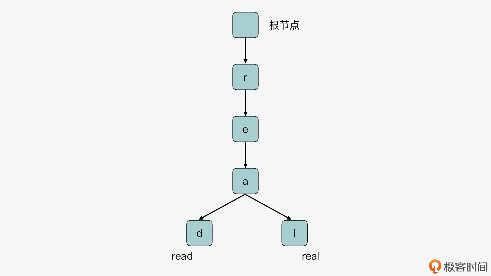

07 | 为什么Stream使用了Radix Tree？

Redis 从 5.0 版本开始支持提供 Stream 数据类型，它可以用来保存消息数据，进而能帮助我们实现一个带有消息读写基本功能的消息队列，并用于日常的分布式程序通信当中。我在讲如何使用 Redis 实现消息队列的时候，曾介绍过 Stream。当时，有不少同学就说想学习了解下 Stream 的实现，以便掌握 Stream 内部结构的操作特点，但自己对 Stream 类型不太熟悉，不知道 Stream 底层是采用怎样的数据结构来保存消息数据的。


其实，为了节省内存空间，在 Stream 数据类型的底层数据结构中，采用了 Radix Tree 和 listpack 两种数据结构来保存消息。我在第 6 讲已经给你介绍过了 listpack，它是一个紧凑型列表，在保存数据时会非常节省内存。

所以今天这节课，我就来给你介绍下 Stream 用到的另一个数据结构 Radix Tree。这个数据结构的最大特点是适合保存具有相同前缀的数据，从而实现节省内存空间的目标，以及支持范围查询。


同时，和常见的 B 树或 B+ 树类似，Radix Tree 也是一种重要的树型结构，在操作系统内核和数据库中也有应用。所以，了解 Radix Tree 的设计与实现，既可以帮助我们掌握 Stream 的实现思路，还可以让我们把 Radix Tree 应用到需要节省内存的有序树型索引场景中，进一步解决具有公共前缀的大量数据保存时的内存开销问题。

好，那么接下来，我们先来了解下 Stream 保存的消息数据的特征，这也是 Redis 使用 Radix Tree 和 listpack 作为底层结构保存消息的重要考虑因素。

#### Stream 消息数据的特征

首先，Stream 作为消息队列，它保存的消息通常具有以下两个特征：
 
- 一条消息由一个或多个键值对组成；
- 每插入一条消息，这条消息都会对应一个消息 ID。

比如，我在 Redis 实例中执行以下操作，可以向名为 devmsg 的消息流中，连续插入 5 条消息。其中，每条消息记录的是某个设备 ID 对应的设备温度信息。


```angular2html

127.0.0.1:6379> XADD devmsg * dev 3 temp 26
"1628172536845-0"
127.0.0.1:6379> XADD devmsg * dev 5 temp 28
"1628172545411-0"
127.0.0.1:6379> XADD devmsg * dev 8 temp 24
"1628172553528-0"
127.0.0.1:6379> XADD devmsg * dev 1 temp 25
"1628172560442-0"
127.0.0.1:6379> XADD devmsg * dev 5 temp 26
"1628172565683-0"
```

从上面的插入数据和返回结果中，我们可以看到，对应 Stream 类型来说，它需要保存的数据也具有两个特征：

- 连续插入的消息 ID，其前缀有较多部分是相同的。比如，刚才插入的 5 条消息，它们消息 ID 的前 8 位都是 16281725。 
- 连续插入的消息，它们对应键值对中的键通常是相同的。比如，刚才插入的 5 条消息，它们消息中的键都是 dev 和 temp。

你可能会想到使用哈希表，一个消息 ID 对应哈希表中的一个 key，消息内容对应这个 key 的 value。但是，就像刚才介绍的数据特征一样，消息 ID 和消息中的键经常会有重复的部分。如果使用哈希表，就会导致有不少冗余数据，这会浪费 Redis 宝贵的内存空间。

因此，为了充分节省内存空间，Stream 使用了两种内存友好的数据结构：listpack 和 Radix Tree。其中，消息 ID 是作为 Radix Tree 中的 key，消息具体数据是使用 listpack 保存，并作为 value 和消息 ID 一起保存到 Radix Tree 中。

你可以看看下面的 Stream 结构体定义，其中，消息就是使用 Radix Tree 类型的结构*rax来保存的。

```angular2html

typedef struct stream {
    rax *rax;               //保存消息的Radix Tree
    uint64_t length;        //消息流中的消息个数
    streamID last_id;       //当前消息流中最后插入的消息的ID
    rax *cgroups;           //当前消息流的消费组信息，也是用Radix Tree保存
} stream;
```


好了，那么 Radix Tree 的结构到底是怎样的呢？下面我们就来学习下 Radix Tree 的基本结构。

#### Radix Tree 的基本结构

Radix Tree 是属于前缀树的一种类型。前缀树也称为 Trie Tree，它的特点是，保存在树上的每个 key 会被拆分成单字符，然后逐一保存在树上的节点中。前缀树的根节点不保存任何字符，而除了根节点以外的其他节点，每个节点只保存一个字符。当我们把从根节点到当前节点的路径上的字符拼接在一起时，就可以得到相应 key 的值了。

下面这张图展示了一个简单的前缀树，你可以看下。图中的前缀树有两个叶子节点，将根节点到这两个叶子节点的路径上，对应的字符拼接起来后，就得到了两个 key：read 和 real。




另外从图中，我们还可以看到，前缀树是把保存的 key 的公共前缀（即 r、e、a）独立出来共享使用的。这样一来，就可以避免在树中对相同的字符做重复存储。

而如果不采用这种方法，只是把这两个 key 保存在哈希表中，那么 key 的相同前缀就会被单独存储，这样就会导致内存空间的浪费。所以，相比哈希表的保存方式，前缀树能够很好地节省内存空间，这对于 Redis 来说是非常重要的。