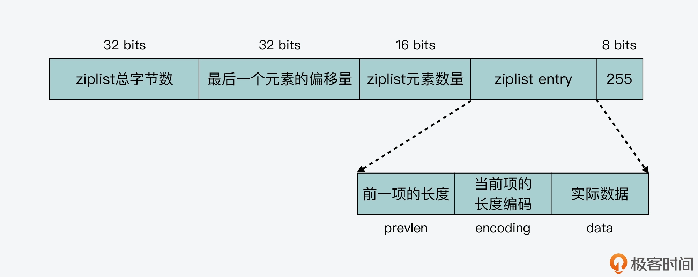
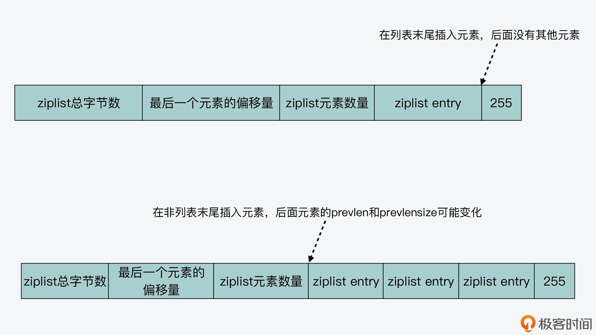
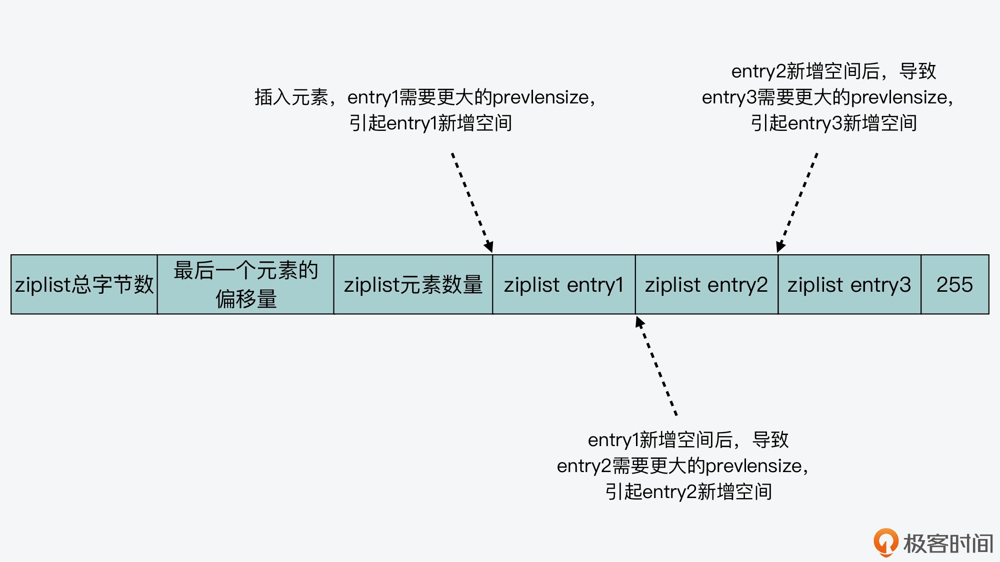
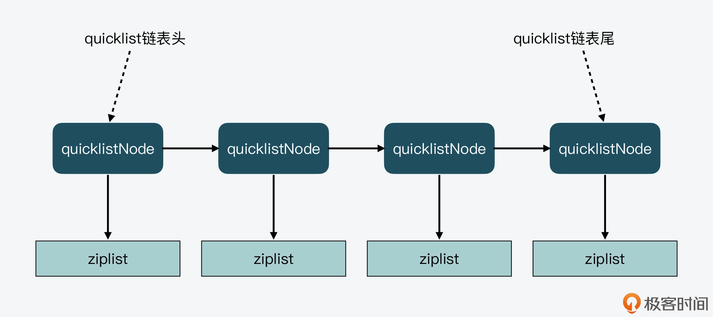

# 06 | 从ziplist到quicklist，再到listpack的启发

在前面的第 4 讲，我介绍 Redis 优化设计数据结构来提升内存利用率的时候，提到可以使用压缩列表（ziplist）来保存数据。所以现在你应该也知道，ziplist 的最大特点，就是它被设计成一种内存紧凑型的数据结构，占用一块连续的内存空间，以达到节省内存的目的。

但是，在计算机系统中，任何一个设计都是有利有弊的。对于 ziplist 来说，这个道理同样成立。


虽然 ziplist 节省了内存开销，可它也存在两个设计代价：一是不能保存过多的元素，否则访问性能会降低；二是不能保存过大的元素，否则容易导致内存重新分配，甚至可能引发连锁更新的问题。所谓的连锁更新，简单来说，就是 ziplist 中的每一项都要被重新分配内存空间，造成 ziplist 的性能降低。

因此，针对 ziplist 在设计上的不足，Redis 代码在开发演进的过程中，新增设计了两种数据结构：quicklist 和 listpack。这两种数据结构的设计目标，就是尽可能地保持 ziplist 节省内存的优势，同时避免 ziplist 潜在的性能下降问题。


今天这节课，我就来给你详细介绍下 quicklist 和 listpack 的设计思想和实现思路，不过在具体讲解这两种数据结构之前，我想先带你来了解下为什么 ziplist 的设计会存在缺陷。这样一来，你在学习 quicklist 和 listpack 时，可以和 ziplist 的设计进行对比，进一步就能更加容易地掌握 quicklist 和 listpack 的设计考虑了。

而且，ziplist 和 quicklist 的区别，也是经常被问到的面试题，而 listpack 数据结构因为比较新，你对它的设计实现可能了解得并不多。那在学完了这节课之后，你其实就可以很轻松地应对这三种数据结构的使用问题了。此外，你还可以从这三种数据结构的逐步优化设计中，学习到 Redis 数据结构在内存开销和访问性能之间，采取的设计取舍思想。如果你需要开发高效的数据结构，你就可以把这种设计思想应用起来。


### ziplist 的不足
你已经知道，一个 ziplist 数据结构在内存中的布局，就是一块连续的内存空间。这块空间的起始部分是大小固定的 10 字节元数据，其中记录了 ziplist 的总字节数、最后一个元素的偏移量以及列表元素的数量，而这 10 字节后面的内存空间则保存了实际的列表数据。在 ziplist 的最后部分，是一个 1 字节的标识（固定为 255），用来表示 ziplist 的结束，如下图所示：


不过，虽然 ziplist 通过紧凑的内存布局来保存数据，节省了内存空间，但是 ziplist 也面临着随之而来的两个不足：查找复杂度高和潜在的连锁更新风险。那么下面，我们就分别来了解下这两个问题。


#### 查找复杂度高

因为 ziplist 头尾元数据的大小是固定的，并且在 ziplist 头部记录了最后一个元素的位置，所以，当在 ziplist 中查找第一个或最后一个元素的时候，就可以很快找到。

但问题是，当要查找列表中间的元素时，ziplist 就得从列表头或列表尾遍历才行。而当 ziplist 保存的元素过多时，查找中间数据的复杂度就增加了。更糟糕的是，如果 ziplist 里面保存的是字符串，ziplist 在查找某个元素时，还需要逐一判断元素的每个字符，这样又进一步增加了复杂度。


也正因为如此，我们在使用 ziplist 保存 Hash 或 Sorted Set 数据时，都会在 redis.conf 文件中，通过 hash-max-ziplist-entries 和 zset-max-ziplist-entries 两个参数，来控制保存在 ziplist 中的元素个数。


不仅如此，除了查找复杂度高以外，ziplist 在插入元素时，如果内存空间不够了，ziplist 还需要重新分配一块连续的内存空间，而这还会进一步引发连锁更新的问题。


#### 连锁更新风险

我们知道，因为 ziplist 必须使用一块连续的内存空间来保存数据，所以当新插入一个元素时，ziplist 就需要计算其所需的空间大小，并申请相应的内存空间。这一系列操作，我们可以从 ziplist 的元素插入函数 __ziplistInsert 中看到。

__ziplistInsert 函数首先会计算获得当前 ziplist 的长度，这个步骤通过 ZIPLIST_BYTES 宏定义就可以完成，如下所示。同时，该函数还声明了 reqlen 变量，用于记录插入元素后所需的新增空间大小。


```angular2html

//获取当前ziplist长度curlen；声明reqlen变量，用来记录新插入元素所需的长度
size_t curlen = intrev32ifbe(ZIPLIST_BYTES(zl)), reqlen;
```


然后，__ziplistInsert 函数会判断当前要插入的位置是否是列表末尾。如果不是末尾，那么就需要获取位于当前插入位置的元素的 prevlen 和 prevlensize。这部分代码如下所示：

```angular2html

//如果插入的位置不是ziplist末尾，则获取前一项长度
   if (p[0] != ZIP_END) {
    ZIP_DECODE_PREVLEN(p, prevlensize, prevlen);
    } else {
       …
    }
```

实际上，在 ziplist 中，每一个元素都会记录其前一项的长度，也就是 prevlen。然后，为了节省内存开销，ziplist 会使用不同的空间记录 prevlen，这个 prevlen 空间大小就是 prevlensize。



[//]: # (第一步，计算实际插入元素的长度。)

[//]: # ()
[//]: # (首先你要知道，这个计算过程和插入元素是整数还是字符串有关。__ziplistInsert 函数会先调用 zipTryEncoding 函数，这个函数会判断插入元素是否为整数。如果是整数，就按照不同的整数大小，计算 encoding 和实际数据 data 各自所需的空间；如果是字符串，那么就先把字符串长度记录为所需的新增空间大小。这一过程的代码如下所示：)

[//]: # (```angular2html)

[//]: # ()
[//]: # (  if &#40;zipTryEncoding&#40;s,slen,&value,&encoding&#41;&#41; {)

[//]: # (          reqlen = zipIntSize&#40;encoding&#41;;)

[//]: # (      } else {)

[//]: # (          reqlen = slen;)

[//]: # (      })

[//]: # (```)


实际上，所谓的连锁更新，就是指当一个元素插入后，会引起当前位置元素新增 prevlensize 的空间。而当前位置元素的空间增加后，又会进一步引起该元素的后续元素，其 prevlensize 所需空间的增加。


这样，一旦插入位置后续的所有元素，都会因为前序元素的 prevlenszie 增加，而引起自身空间也要增加，这种每个元素的空间都需要增加的现象，就是连锁更新。我画了下面这张图，你可以看下。




所以说，虽然 ziplist 紧凑型的内存布局能节省内存开销，但是如果保存的元素数量增加了，或是元素变大了，ziplist 就会面临性能问题。那么，有没有什么方法可以避免 ziplist 的问题呢？

#### quicklist 设计与实现

quicklist 的设计，其实是结合了链表和 ziplist 各自的优势。简单来说，一个 quicklist 就是一个链表，而链表中的每个元素又是一个 ziplist。

我们来看下 quicklist 的数据结构，这是在quicklist.h文件中定义的，而 quicklist 的具体实现是在quicklist.c文件中。

首先，quicklist 元素的定义，也就是 quicklistNode。因为 quicklist 是一个链表，所以每个 quicklistNode 中，都包含了分别指向它前序和后序节点的指针*prev和*next。同时，每个 quicklistNode 又是一个 ziplist，所以，在 quicklistNode 的结构体中，还有指向 ziplist 的指针*zl。

此外，quicklistNode 结构体中还定义了一些属性，比如 ziplist 的字节大小、包含的元素个数、编码格式、存储方式等。下面的代码显示了 quicklistNode 的结构体定义，你可以看下。

```angular2html

typedef struct quicklistNode {
    struct quicklistNode *prev;     //前一个quicklistNode
    struct quicklistNode *next;     //后一个quicklistNode
    unsigned char *zl;              //quicklistNode指向的ziplist
    unsigned int sz;                //ziplist的字节大小
    unsigned int count : 16;        //ziplist中的元素个数 
    unsigned int encoding : 2;   //编码格式，原生字节数组或压缩存储
    unsigned int container : 2;  //存储方式
    unsigned int recompress : 1; //数据是否被压缩
    unsigned int attempted_compress : 1; //数据能否被压缩
    unsigned int extra : 10; //预留的bit位
} quicklistNode;
```
了解了 quicklistNode 的定义，我们再来看下 quicklist 的结构体定义。

quicklist 作为一个链表结构，在它的数据结构中，是定义了整个 quicklist 的头、尾指针，这样一来，我们就可以通过 quicklist 的数据结构，来快速定位到 quicklist 的链表头和链表尾。

此外，quicklist 中还定义了 quicklistNode 的个数、所有 ziplist 的总元素个数等属性。quicklist 的结构定义如下所示：

```angular2html

typedef struct quicklist {
    quicklistNode *head;      //quicklist的链表头
    quicklistNode *tail;      //quicklist的链表尾
    unsigned long count;     //所有ziplist中的总元素个数
    unsigned long len;       //quicklistNodes的个数
    ...
} quicklist;
```

quicklist 作为一个链表结构，在它的数据结构中，是定义了整个 quicklist 的头、尾指针，这样一来，我们就可以通过 quicklist 的数据结构，来快速定位到 quicklist 的链表头和链表尾。此外，quicklist 中还定义了 quicklistNode 的个数、所有 ziplist 的总元素个数等属性。quicklist 的结构定义如下所示：

```angular2html

typedef struct quicklist {
    quicklistNode *head;      //quicklist的链表头
    quicklistNode *tail;      //quicklist的链表尾
    unsigned long count;     //所有ziplist中的总元素个数
    unsigned long len;       //quicklistNodes的个数
    ...
} quicklist;
```

然后，从 quicklistNode 和 quicklist 的结构体定义中，我们就能画出下面这张 quicklist 的示意图。



而也正因为 quicklist 采用了链表结构，所以当插入一个新的元素时，quicklist 首先就会检查插入位置的 ziplist 是否能容纳该元素，这是通过 _quicklistNodeAllowInsert 函数来完成判断的。


_quicklistNodeAllowInsert 函数会计算新插入元素后的大小（new_sz），这个大小等于 quicklistNode 的当前大小（node->sz）、插入元素的大小（sz），以及插入元素后 ziplist 的 prevlen 占用大小。


在计算完大小之后，_quicklistNodeAllowInsert 函数会依次判断新插入的数据大小（sz）是否满足要求，即单个 ziplist 是否不超过 8KB，或是单个 ziplist 里的元素个数是否满足要求。

只要这里面的一个条件能满足，quicklist 就可以在当前的 quicklistNode 中插入新元素，否则 quicklist 就会新建一个 quicklistNode，以此来保存新插入的元素。


下面代码显示了是否允许在当前 quicklistNode 插入数据的判断逻辑，你可以看下。

```angular2html

unsigned int new_sz = node->sz + sz + ziplist_overhead;
if (likely(_quicklistNodeSizeMeetsOptimizationRequirement(new_sz, fill)))
    return 1;
else if (!sizeMeetsSafetyLimit(new_sz))
    return 0;
else if ((int)node->count < fill)
    return 1;
else
    return 0;
```